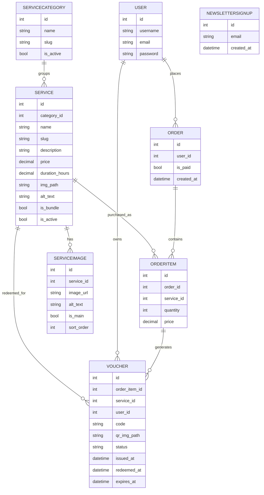

# The Wag Club
> Pampering pups, one wag at a time.

## Contents
- [The Wag Club](#the-wag-club)
  - [Contents](#contents)
  - [Overview](#overview)
  - [Architecture](#architecture)
  - [Live Demo \& Repository](#live-demo--repository)
  - [Product Screenshots](#product-screenshots)
  - [Features](#features)
  - [Frontend](#frontend)
  - [Backend](#backend)
  - [Tech Stack](#tech-stack)
  - [Data Model](#data-model)
    - [Entities](#entities)
    - [ERD Diagram (Mermaid)](#erd-diagram-mermaid)
  - [User Experience](#user-experience)
  - [Design \& Branding](#design--branding)
  - [Stripe Payments](#stripe-payments)
  - [Deployment (Heroku)](#deployment-heroku)
  - [Local Development](#local-development)
  - [Environment Variables](#environment-variables)
  - [Bugs Encountered](#bugs-encountered)
  - [Testing](#testing)
  - [Future Enhancements](#future-enhancements)
  - [User Guide](#user-guide)
  - [Admin Guide](#admin-guide)
  - [Business Model](#business-model)
  - [Marketing \& SEO](#marketing--seo)
  - [Validation \& Quality](#validation--quality)
  - [DevOps \& Tooling](#devops--tooling)
  - [Credits](#credits)
  - [License](#license)

## Overview
The Wag Club is a Django-powered e-commerce site for a dog daycare and grooming business. Customers browse services, add them to a cart, and pay through Stripe. Successful payments generate time-bound vouchers with QR codes that can be redeemed on-site. A customer wallet keeps active, redeemed, and expired vouchers organised; staff can scan and redeem vouchers securely.

## Architecture
- Monolithic Django 5 project split into domain apps:
  - `services`: service catalog, categories, images, search.
  - `orders`: cart, Stripe checkout session creation, webhook fulfilment, vouchers, wallet, redemption.
  - `project_core`: project settings, URLs, static/media configuration.
- Frontend rendered with Django templates + Bootstrap 5; no custom API layer required for core flows.
- Payments handled server-side via Stripe Checkout and webhooks to keep keys secret and ensure orders/vouchers are created after confirmed payment.

## Live Demo & Repository
- Live Site (Heroku): [Heroku](https://the-wagclub-0b0521e2a364.herokuapp.com/)
- Repository: [Github](https://github.com/KellyT4425/The_WagClub)

## Product Screenshots
Replace the placeholders with your captures (examples below point to `static/images/*`):


- Services listing: `static/images/services-list.png`
- Cart & checkout: `static/images/cart-checkout.png`
- Wallet & voucher detail: `static/images/wallet.png`
- Admin/staff view (optional): `static/images/admin.png`
- Social page (alt): `static/images/facebook-eg.png` / `static/images/insta-post.png`

## Features
- Service browsing with categories (Passes, Packages, Offers) and search.
- Cart and checkout via Stripe Checkout Sessions with order metadata.
- Voucher generation per line item quantity, including QR codes and expiry.
- Customer wallet grouped by status: Active, Redeemed, Expired.
- Voucher detail and printable invoice with QR code.
- Staff redemption via scan or manual code lookup.
- Authentication (register, login, logout, password reset) via Django AllAuth.
- Responsive UI with Bootstrap 5 and custom branding.
- Social proof: footer links to reviews/contact plus Instagram and Facebook presence.

## Frontend
- Templates: Django templates with Bootstrap 5, custom CSS in `static/css/base.css`.
- Layout: responsive navbar, footer social links, toast notifications for feedback.
- Pages: home hero, services list/detail, cart/checkout, wallet, voucher detail/invoice, staff scan/redeem.
- UX: search/filter on services; status badges for vouchers (Active/Redeemed/Expired); accessible form controls and alt text on imagery.
- Icons: Font Awesome for UI glyphs; branded imagery in `static/images`.

## Backend
- Django 5 with two domain apps: `services` (catalog) and `orders` (cart, payments, vouchers).
- Payments: Stripe Checkout session creation (`orders.views.create_checkout_session`) and webhook fulfilment (`orders.views.stripe_webhook`).
- Business logic:
  - Order and order items created only after confirmed payment event.
  - Vouchers generated per quantity with unique codes and QR images, default expiry 18 months.
  - Wallet views filter vouchers by status; staff-only redemption via `scan_voucher`/`redeem_voucher`.
- Auth: Django AllAuth for registration/login/logout/password reset.
- Media: Cloudinary for images; QR codes stored via ImageField.
- Static: WhiteNoise for compressed static serving; Bootstrap/FontAwesome from CDNs.
- Management commands for media health:
  - `python manage.py migrate_media_to_cloudinary [--dry-run]` (upload local media to Cloudinary via default storage).
  - `python manage.py check_media_urls` (HEAD check service/media URLs for 404s).

## Tech Stack

| Layer | Technologies |
|-------|--------------|
| Frontend | HTML5, CSS3, Bootstrap 5, JavaScript |
| Backend | Python 3.12, Django 5 |
| Database | PostgreSQL (Heroku Postgres) |
| Authentication | Django AllAuth |
| Payments | Stripe Checkout Sessions & Webhooks |
| Media Storage | Cloudinary (`django-cloudinary-storage`) |
| Static Files | WhiteNoise (compressed & cached) |
| QR Generation | `qrcode` |
| Environment | `python-dotenv`, virtualenv/venv |
| Deployment | Heroku (Python buildpack, Postgres add-on) |
| Version Control | Git & GitHub |

## Data Model
### Entities
- `ServiceCategory`: Groups services into Passes, Packages, Offers; slugged for URLs.
- `Service`: A purchasable pass/package/offer with price, duration, imagery, and active toggle.
- `ServiceImage`: Optional gallery per service; unique main image enforced.
- `Order`: A paid checkout linked to a user.
- `OrderItem`: Line items within an order, storing service, quantity, and locked-in price.
- `Voucher`: Generated per order item *and* quantity (multiple vouchers per item when quantity > 1); tracks code, QR image, status (ISSUED, REDEEMED, EXPIRED), issued/redeemed/expiry timestamps, and expiry (default 18 months).
- `User`: Django auth user (owner of orders and vouchers).

### ERD Diagram (Mermaid)


## User Experience
- Navigation: clear navbar (Home, Services, Cart, Account), footer with newsletter + socials.
- Search/filters: services list supports search; detail pages show gallery + add-to-cart.
- Vouchers: wallet grouped by Active/Redeemed/Expired; status badges and QR for active.
- Redemption: staff-only endpoint; customers see status, not redeem controls.
- Feedback: toast messages, form errors visible; success states after checkout/subscription.
- Styling: Patrick Hand SC for headings, Lato for body; soft palette with status accents.
- Accessibility: alt text on images, focusable controls, consistent spacing; WAVE checks.

## Design & Branding
- Typography: Patrick Hand SC (headings/accent) and Lato (body) via Google Fonts; handwritten accent for warmth, clean sans for readability.
- Palette: Soft neutrals with green/orange/red status accents for voucher states; transparent search bar and bordered info cards for clarity.
- Icons: Font Awesome for UI glyphs; branded paw/QR assets in `static/images`.
- Favicon: Included under `static/images` to keep brand presence across tabs/devices.
- Layout: Mobile-first Bootstrap 5 grid; consistent card spacing, badges for statuses, and responsive footer (newsletter + socials).
- Wireframes: Include/export your key page mockups (home, services list/detail, cart/checkout, wallet) under `static/docs/` and reference them here if required by assessment.

## Stripe Payments
- Uses Stripe Checkout Sessions with metadata (`user_id`, cart items) to recreate orders on webhook success.
- Webhook endpoint: `/orders/checkout/webhook/` (`orders:stripe_webhook`).
- Success redirect: `/orders/success/?session_id={CHECKOUT_SESSION_ID}`.
- Requires `STRIPE_SECRET_KEY`, `STRIPE_PUBLISHABLE_KEY`, and `STRIPE_WEBHOOK_SECRET` (signing secret). Optional: a restricted key if you perform server-side API calls elsewhere.

## Deployment (Heroku)
1) Create Heroku app and add Heroku Postgres.
2) Set config vars (see Environment Variables).
3) `heroku config:set DISABLE_COLLECTSTATIC=0` (only if collectstatic should run).
4) Deploy via GitHub integration or `git push heroku main`.
5) Run migrations: `heroku run python manage.py migrate`.
6) Create superuser: `heroku run python manage.py createsuperuser`.
7) Add allowed host and CSRF origins for your Heroku domain.
8) Set Stripe webhook to `https://<your-app>.herokuapp.com/orders/checkout/webhook/` with the signing secret stored in `STRIPE_WEBHOOK_SECRET`.

## Local Development
```bash
python -m venv .venv
.\.venv\Scripts\activate  # Windows
# source .venv/bin/activate  # macOS/Linux
pip install -r requirements.txt
cp .env.example .env
python manage.py migrate
python manage.py runserver
```
With `DEBUG=True`, the app uses SQLite and permissive hosts for localhost/testserver.

## Environment Variables
Set these in `.env` locally and in Heroku config vars for production:

- `SECRET_KEY` — Django secret key.
- `DEBUG` — `True` (local) / `False` (production).
- `ALLOWED_HOSTS` — comma-separated (e.g., `localhost,127.0.0.1,<your-app>.herokuapp.com`).
- `CSRF_TRUSTED_ORIGINS` — comma-separated origins (e.g., `https://<your-app>.herokuapp.com`).
- `DATABASE_URL` — Postgres connection string (Heroku supplies this).
- `CLOUDINARY_URL` — Cloudinary media storage URL.
- `STRIPE_SECRET_KEY` — Stripe secret key.
- `STRIPE_PUBLISHABLE_KEY` — Stripe publishable key.
- `STRIPE_WEBHOOK_SECRET` — Stripe webhook signing secret.
- `SITE_URL` — base URL for building absolute QR links (set to your deployed domain).
- Email (if using SMTP): `EMAIL_BACKEND`, `EMAIL_HOST`, `EMAIL_PORT=587`, `EMAIL_USE_TLS=True`, `EMAIL_HOST_USER`, `EMAIL_HOST_PASSWORD`, `DEFAULT_FROM_EMAIL`.

## Bugs Encountered

| Bug | Cause | Fix |
| --- | --- | --- |
| Stripe webhook 400/500 | Mismatched signing secret/version | Use correct `STRIPE_WEBHOOK_SECRET`; resilient verification; idempotent `stripe_session_id` (migration `0006_order_stripe_session_id`) |
| Duplicate orders/admin delete 500 | Missing `stripe_session_id` column in prod DB | Apply migration; skip duplicates in webhook |
| Success page 500/302 | Success view forced login/ownership incorrectly | Trust Stripe metadata; render vouchers with ownership checks |
| QR codes pointing to localhost/404 | Hard-coded media URLs; no SITE_URL | Add QR endpoint `/orders/voucher/<code>/qr/`; use `SITE_URL`; Cloudinary storage |
| Cloudinary 404s for services/QR | Templates used `/media` or `` | Use `.url`; run `migrate_media_to_cloudinary`; `check_media_urls`; re-upload missing |
| Stripe CLI/setup friction | Wrong CLI usage/endpoints | Use `stripe listen` + `stripe trigger`; align webhook/success URLs with deployed domain |
| Minor UI/templating issues | Malformed price tag/templating glitches | Fix templates; harden WhiteNoise/psycopg/Procfile |
| `.env` not loading on Heroku | `.env` in `.gitignore` | Set config vars in Heroku dashboard |
| CLI tools not found (Git Bash/WSL) | Installed only on Windows PATH | Use Windows CLI or update PATH |
| Gunicorn worker boot failed | Deploy misconfiguration | Review Heroku logs; fix settings |
| Date picker not rendering | Wrong widget import | Correct widget import |
| Form allowed invalid dates | Missing `clean()` validation | Add validation to block end-date before start-date |
| Required fields silent | Missing `{{ form.errors }}` | Render form errors in template |
| 404 from URL mismatch | Trailing slash mismatch | Update URL patterns |
| Broken templates after renames | Stale URL names | Update references |
| Migration errors (non-null/rename) | Defaults/null missing; RenameField not used | Supply defaults/null; use proper `RenameField` ops |

## Testing
- Automated: `python manage.py test`
  - Checkout session creation
  - Webhook-driven order/voucher generation
  - Service list view populates categories
  - Update tests as you add features; rerun after migrations/major changes.
- Manual: key flows exercised on desktop/mobile:
  - Add to cart → Stripe Checkout → success clears cart
  - Vouchers in wallet (Active/Redeemed/Expired) with QR visible for Active
  - Staff redemption via scan/manual code updates status
  - Responsive checks for nav, forms, cards, footer
  - More detailed cases and results are in [testing.md](testing.md).

## Future Enhancements
- User-facing:
  - Email/SMS notifications for expiring vouchers
  - Customer order history and invoices archive
  - Discount codes and promotional bundles
  - Reviews/ratings for services
- Admin/staff:
  - Staff dashboard with voucher search/filter
  - Bulk actions for voucher status/expiry
  - Rich analytics (redemption rates, revenue by service)
  - Waitlist or repeat/favourites flows (exploratory)

## User Guide
- Browse services: go to Services, search/filter, view details, add to cart.
- Checkout: proceed to Stripe Checkout, pay with test card (4242... in test mode).
- After payment: view success page; vouchers appear in My Wallet with QR codes.
- Redeem: staff scan the QR (staff-only redeem URL) and redeem via POST; customers see status only.
- Account: register/login via AllAuth; wallet shows Active/Redeemed/Expired vouchers.
- Newsletter: subscribe via footer form.
- Roles: customers can browse, pay, and view their vouchers; staff/admin can redeem and manage via admin. Login state is shown in the navbar.

## Admin Guide
- Admin login: use Django admin for CRUD on services, categories, images, orders, vouchers, newsletter signups.
- Vouchers: staff/admin can mark redeemed/expired via admin actions; QR links generate on demand.
- Media: stored in Cloudinary; use `migrate_media_to_cloudinary` and `check_media_urls` to manage media health.
- Security: keep secrets in env vars (`STRIPE_SECRET_KEY`, `STRIPE_WEBHOOK_SECRET`, `CLOUDINARY_*`, `SECRET_KEY`, etc.), DEBUG off in prod.
- CRUD: full CRUD available via Django admin for all models; user-facing flows cover create/read/update where applicable (cart/checkout/vouchers).

## Business Model
- Revenue: paid daycare/grooming services purchased online; each purchase issues vouchers for on-site redemption.
- Flow: cart → Stripe Checkout → webhook creates order/vouchers → wallet for customer → staff redeem on scan.
- Value: simplifies booking and redemption, provides clear statuses (Active/Redeemed/Expired), and staff-controlled redemption.

## Marketing & SEO
- Social: Instagram link in footer; Facebook Business Page placeholder is linked in footer (`https://www.facebook.com/profile.php?id=61584298172958`)—replace with your real page if different. Include live/placeholder screenshots in Product Screenshots for assessment.
- Newsletter: footer signup stored in `NewsletterSignup`.
- SEO: meta description/keywords in `base.html`, title block; `robots.txt` allows all and points to `/sitemap.xml`; `sitemap.xml` lists key pages (home, services, wallet, login, signup); 404 page present. Add per-page meta if desired.
- Agile/UX: maintain user stories/backlog in your Agile board and link it here; include wireframes/mockups (e.g., in `static/docs/`) and reference them in this README for assessment.

## Validation & Quality
- HTML/CSS: W3C validators on deployed pages; vendor prefixes retained for cross-browser support.
- Accessibility: WAVE checks; alt text, labels, focus states; Lighthouse (Accessibility/Best Practices/SEO).
- Python: Ruff linting; Django `check`; code formatted PEP8-style.
- JS: Minimal ES6 usage; JSHint run with modern syntax allowances.
- Templates: djLint for Django template formatting.

## DevOps & Tooling
- Deployment: Heroku (Python buildpack, Postgres add-on), `Procfile` with gunicorn, WhiteNoise static serving.
- Media: Cloudinary for service images and generated QR PNGs.
- CLI/ops: Stripe CLI for test events; `migrate_media_to_cloudinary` and `check_media_urls` for media health.
- Version control: Git/GitHub; environment via `.env` (python-dotenv locally).

## Credits
- Design: The Wag Club brand assets (logo, palette, typography).
- Images: Stored in `static/images` (hero, service imagery, social mockups).
- Libraries: Django, Bootstrap, Stripe, qrcode, Cloudinary, WhiteNoise, Django AllAuth.
- Tools/References: Stripe docs (Checkout, Webhooks, CLI), Django docs (storage, management commands), Cloudinary docs (Django storage), Heroku runtime/buildpack docs; Ruff for linting.
- Testing/ops: `migrate_media_to_cloudinary`, `check_media_urls`, `migrate_media_to_cloudinary`, Stripe CLI for webhook/checkout event testing.

## License
This project is for educational purposes. Review third-party licenses for dependencies (Django, Bootstrap, Stripe, Cloudinary, etc.) before commercial use.
