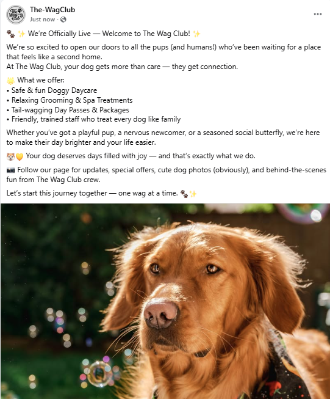
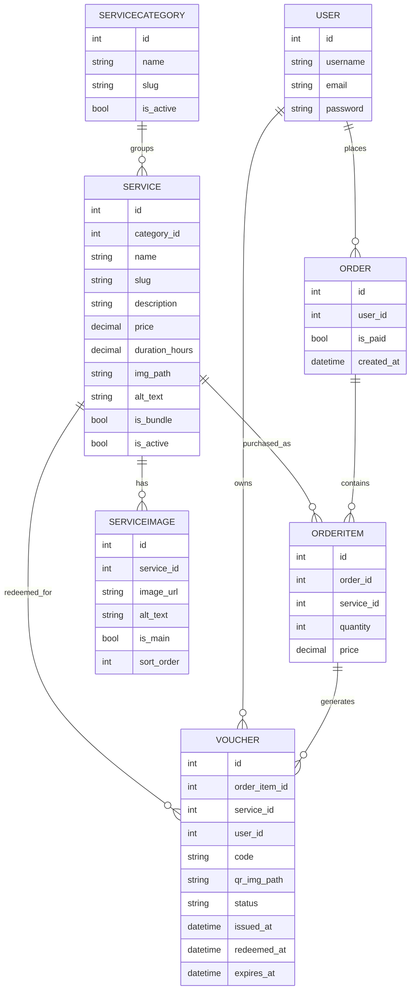
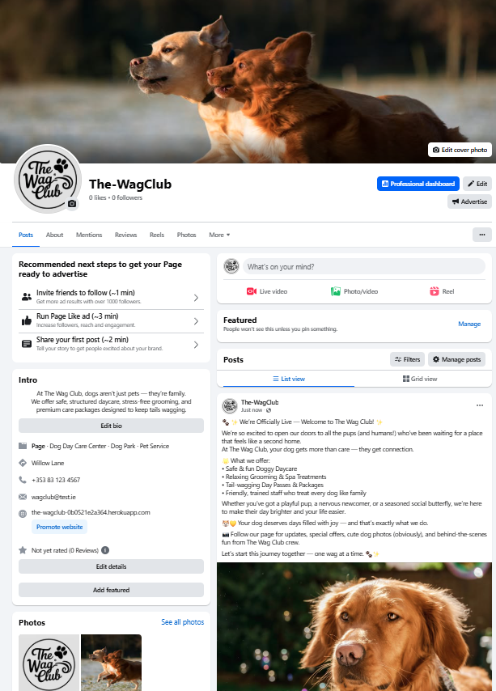

# The Wag Club
> Pampering pups, one wag at a time.

## Contents
- [The Wag Club](#the-wag-club)
  - [Contents](#contents)
- [Overview](#overview)
- [Architecture](#architecture)
- [Live Demo \& Repository](#live-demo--repository)
- [Product Screenshots](#product-screenshots)
- [Features](#features)
- [Frontend](#frontend)
- [Backend](#backend)
- [Tech Stack](#tech-stack)
- [Data Model](#data-model)
- [User Experience](#user-experience)
  - [Stripe Payments](#stripe-payments)
- [Deployment (Heroku)](#deployment-heroku)
- [Local Development](#local-development)
- [Environment Variables](#environment-variables)
- [Bugs Encountered](#bugs-encountered)
- [Testing](#testing)
- [Manual Testing](#manual-testing)
- [Social Media Presence](#social-media-presence)
  - [Future Enhancements](#future-enhancements)
  - [Credits](#credits)

## Overview
The Wag Club is a Django-powered e-commerce site for a dog daycare and grooming business. Customers browse services, add them to a cart, and pay through Stripe. Successful payments generate time-bound vouchers with QR codes that can be redeemed on-site. A customer wallet keeps active, redeemed, and expired vouchers organised; staff can scan and redeem vouchers securely.

## Architecture
- Monolithic Django 5 project split into domain apps:
  - `services`: service catalog, categories, images, search.
  - `orders`: cart, Stripe checkout session creation, webhook fulfilment, vouchers, wallet, redemption.
  - `project_core`: project settings, URLs, static/media configuration.
- Frontend rendered with Django templates + Bootstrap 5; no custom API layer required for core flows.
- Payments handled server-side via Stripe Checkout and webhooks to keep keys secret and ensure orders/vouchers are created after confirmed payment.

## Live Demo & Repository
- Live Site (Heroku): [https://\<your-heroku-app>.herokuapp.com/](https://<your-heroku-app>.herokuapp.com/)
- Repository: [https://github.com/\<user>/\<repo>](https://github.com/<user>/<repo>)

## Product Screenshots
Replace the placeholders with your captures (examples below point to `static/images/*`):




- Services listing: `static/images/services-list.png`
- Cart & checkout: `static/images/cart-checkout.png`
- Wallet & voucher detail: `static/images/wallet.png`
- Admin/staff view (optional): `static/images/admin.png`
- Social page (alt): `static/images/facebook-eg.png` / `static/images/insta-post.png`

## Features
- Service browsing with categories (Passes, Packages, Offers) and search.
- Cart and checkout via Stripe Checkout Sessions with order metadata.
- Voucher generation per line item quantity, including QR codes and expiry.
- Customer wallet grouped by status: Active, Redeemed, Expired.
- Voucher detail and printable invoice with QR code.
- Staff redemption via scan or manual code lookup.
- Authentication (register, login, logout, password reset) via Django AllAuth.
- Responsive UI with Bootstrap 5 and custom branding.
- Social proof: footer links to reviews/contact plus Instagram and Facebook presence.

## Frontend
- Templates: Django templates with Bootstrap 5, custom CSS in `static/css/base.css`.
- Layout: responsive navbar, footer social links, toast notifications for feedback.
- Pages: home hero, services list/detail, cart/checkout, wallet, voucher detail/invoice, staff scan/redeem.
- UX: search/filter on services; status badges for vouchers (Active/Redeemed/Expired); accessible form controls and alt text on imagery.
- Icons: Font Awesome for UI glyphs; branded imagery in `static/images`.

## Backend
- Django 5 with two domain apps: `services` (catalog) and `orders` (cart, payments, vouchers).
- Payments: Stripe Checkout session creation (`orders.views.create_checkout_session`) and webhook fulfilment (`orders.views.stripe_webhook`).
- Business logic:
  - Order and order items created only after confirmed payment event.
  - Vouchers generated per quantity with unique codes and QR images, default expiry 18 months.
  - Wallet views filter vouchers by status; staff-only redemption via `scan_voucher`/`redeem_voucher`.
- Auth: Django AllAuth for registration/login/logout/password reset.
- Media: Cloudinary for images; QR codes stored via ImageField.
- Static: WhiteNoise for compressed static serving; Bootstrap/FontAwesome from CDNs.

## Tech Stack

| Layer | Technologies |
|-------|--------------|
| Frontend | HTML5, CSS3, Bootstrap 5, JavaScript |
| Backend | Python 3.12, Django 5 |
| Database | PostgreSQL (Heroku Postgres) |
| Authentication | Django AllAuth |
| Payments | Stripe Checkout Sessions & Webhooks |
| Media Storage | Cloudinary (`django-cloudinary-storage`) |
| Static Files | WhiteNoise (compressed & cached) |
| QR Generation | `qrcode` |
| Environment | `python-dotenv`, virtualenv/venv |
| Deployment | Heroku (Python buildpack, Postgres add-on) |
| Version Control | Git & GitHub |

## Data Model
### Entities
- `ServiceCategory`: Groups services into Passes, Packages, Offers; slugged for URLs.
- `Service`: A purchasable pass/package/offer with price, duration, imagery, and active toggle.
- `ServiceImage`: Optional gallery per service; unique main image enforced.
- `Order`: A paid checkout linked to a user.
- `OrderItem`: Line items within an order, storing service, quantity, and locked-in price.
- `Voucher`: Generated per order item *and* quantity (multiple vouchers per item when quantity > 1); tracks code, QR image, status (ISSUED, REDEEMED, EXPIRED), issued/redeemed/expiry timestamps, and expiry (default 18 months).
- `User`: Django auth user (owner of orders and vouchers).

### ERD Diagram (Mermaid)


## User Experience
- Navigation: Home, Services, Cart, Account dropdown, with footer links to Reviews and Contact.
- Styling: Handwritten-style headings, soft palette, clean cards, mobile-friendly layout.
- Accessibility: Alt text on imagery, focusable buttons/links, toasts for feedback.

## Stripe Payments
- Uses Stripe Checkout Sessions with metadata (`user_id`, cart items) to recreate orders on webhook success.
- Webhook endpoint: `/orders/checkout/webhook/` (`orders:stripe_webhook`).
- Success redirect: `/orders/success/?session_id={CHECKOUT_SESSION_ID}`.
- Requires `STRIPE_SECRET_KEY`, `STRIPE_PUBLISHABLE_KEY`, `STRIPE_API_KEY` (restricted key optional), and `STRIPE_WEBHOOK` (signing secret).

## Deployment (Heroku)
1) Create Heroku app and add Heroku Postgres.
2) Set config vars (see Environment Variables).
3) `heroku config:set DISABLE_COLLECTSTATIC=0` (only if collectstatic should run).
4) Deploy via GitHub integration or `git push heroku main`.
5) Run migrations: `heroku run python manage.py migrate`.
6) Create superuser: `heroku run python manage.py createsuperuser`.
7) Add allowed host and CSRF origins for your Heroku domain.
8) Set Stripe webhook to `https://<your-app>.herokuapp.com/orders/checkout/webhook/` with the signing secret stored in `STRIPE_WEBHOOK`.

## Local Development
```bash
python -m venv .venv
.\.venv\Scripts\activate  # Windows
# source .venv/bin/activate  # macOS/Linux
pip install -r requirements.txt
cp .env.example .env
python manage.py migrate
python manage.py runserver
```
With `DEBUG=True`, the app uses SQLite and permissive hosts for localhost/testserver.

## Environment Variables
Set these in `.env` locally and in Heroku config vars for production:

- `SECRET_KEY` — Django secret key.
- `DEBUG` — `True` (local) / `False` (production).
- `ALLOWED_HOSTS` — comma-separated (e.g., `localhost,127.0.0.1,<your-app>.herokuapp.com`).
- `CSRF_TRUSTED_ORIGINS` — comma-separated origins (e.g., `https://<your-app>.herokuapp.com`).
- `DATABASE_URL` — Postgres connection string (Heroku supplies this).
- `STRIPE_SECRET_KEY` — Stripe secret key.
- `STRIPE_PUBLISHABLE_KEY` — Stripe publishable key.
- `STRIPE_API_KEY` — Optional restricted key for server-side API calls.
- `STRIPE_WEBHOOK` — Stripe webhook signing secret.
- `CLOUDINARY_CLOUD_NAME`, `CLOUDINARY_API_KEY`, `CLOUDINARY_API_SECRET` — for media.
- `EMAIL_BACKEND` and SMTP settings if using email (defaults to console backend).

## Bugs Encountered
- Services page 500 on Heroku caused by malformed price template tag (`{{ € s.price }}`); fixed to `€{{ s.price }}`.
- Service card images missing on deploy because Cloudinary storage only activates with `DEBUG=False` and images had not been uploaded; resolved by re-saving media to Cloudinary and pruning duplicate local media files.
- Model/DB mismatches during deployment caused errors; aligned model fields and migrations to production schema.
- Early deploy issues (Procfile/import paths, WhiteNoise/psycopg setup) fixed across deployment hardening commits.

## Testing
- Automated: `python manage.py test`
  - Covers checkout session creation and webhook-driven order/voucher generation.
  - Service list view populates categories.
- Manual (recommended):
  - Add to cart, create Stripe Checkout, ensure success clears cart.
  - Verify vouchers appear in wallet (Active, Redeemed, Expired).
  - Staff redemption via scan/manual code; ensure status changes and permissions hold.
  - Responsive checks on mobile/tablet for nav, forms, and cards.

## Manual Testing
Detailed manual test cases (flows, expected results, and status) are documented in [testing.md](testing.md).

## Social Media Presence
-  Instagram: https://www.instagram.com/thewag_club/
-  Facebook mockups: `static/images/facebook-page.png`, `static/images/facebook-eg.png`
- Include screenshot captures of the live/placeholder page in [Product Screenshots](#product-screenshots) for assessment.

## Future Enhancements
- Email/SMS notifications for expiring vouchers.
- Customer order history and invoices archive.
- Discount codes and promotional bundles.
- Staff dashboard with search/filter for vouchers and redemptions.

## Credits
- Design: The Wag Club brand assets (logo, palette, typography).
- Images: Stored in `static/images` (hero, service imagery, social mockups).
- Libraries: Django, Bootstrap, Stripe, qrcode, Cloudinary, WhiteNoise, Django AllAuth.
