# Testing

Manual test cases grouped by area. Columns: step, expected outcome, result, and evidence (screenshots or notes).

Automated tests (latest run):
- `python manage.py test` — 21 tests passing; covers service search (results and empty), checkout session (empty cart/login), Stripe webhook success/idempotent/bad signature/missing metadata, success view duplication guard, voucher QR/wallet/owner checks, staff scan/redeem (including expired block, invalid code 404).

### Homepage & Navigation
| Test # | Step | Expected | Result | Evidence |
| --- | --- | --- | --- | --- |
| H1 | Load home hero | Hero, CTA, search visible; nav shows Home/Services/Cart/Account | Pass |  |
| H2 | Toggle nav on mobile | Nav collapses to toggle; tap opens vertical menu | Pass | 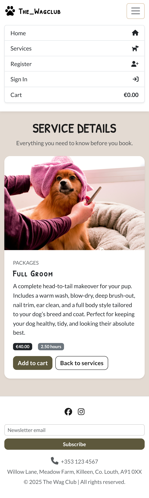 |
| H3 | Browse CTA | Click "Browse" → Services page loads | Pass |  |
| H4 | Services link | Click Services in nav → services page | Pass |  |
| H5 | Newsletter signup | Enter email in footer form shows success toast | Pass | 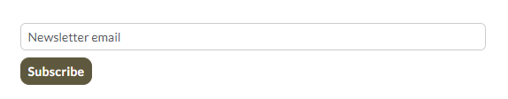 |
| H6 | Social links | Footer Facebook/Instagram open correct tabs | Pass | 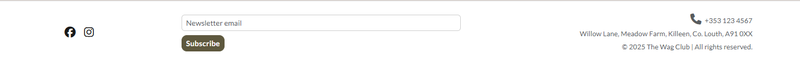 |

### Authentication
| Test # | Step | Expected | Result | Evidence |
| --- | --- | --- | --- | --- |
| A1 | Register new user | Account created; signed-in state shown | Pass | 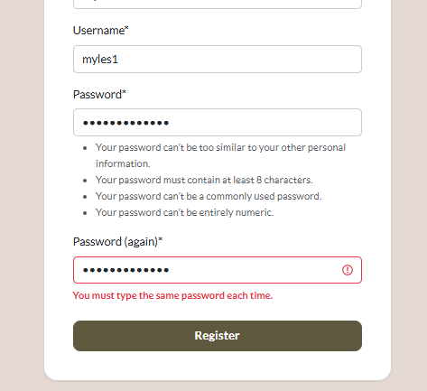 |
| A2 | Login existing user | Redirect to home; nav shows signed-in indicator | Pass | 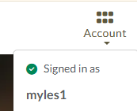 |
| A3 | Logout | Prompts confirm; returns to guest nav | Pass | 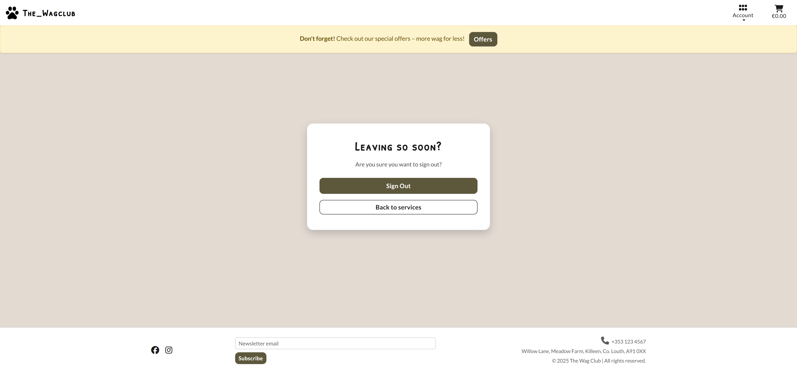 |
| A4 | Forgot password | Email sent; reset link form loads; reset success | Pass | 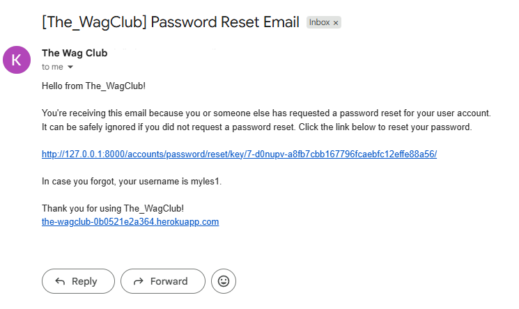   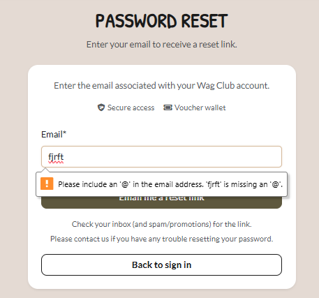   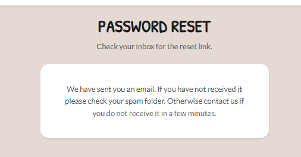 |

### Services & Search
| Test # | Step | Expected | Result | Evidence |
| --- | --- | --- | --- | --- |
| S1 | Search "groom" from home | Services page highlights matching cards | Pass |  |
| S2 | Open service detail | Shows description, price, image, add-to-cart | Pass |  |

### Cart & Checkout
| Test # | Step | Expected | Result | Evidence |
| --- | --- | --- | --- | --- |
| C1 | Add to cart from detail | Item appears in cart with correct price | Pass |  |
| C2 | View cart | Items listed; totals correct; checkout button visible | Pass |  |
| C3 | Remove item | Item removed; empty cart message if none remain | Pass | Verified in UI |
| C4 | Start checkout | Stripe Checkout opens with correct line items | Pass |  |
| C5 | Empty cart state | Shows empty cart message and CTA | Pass | 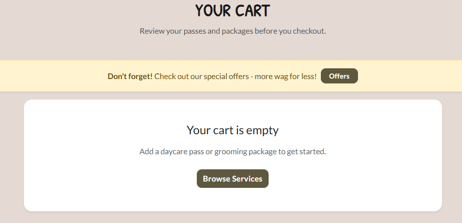 |
| C6 | Cancel checkout | Stripe cancel returns to cart with items intact | Pass | Verified via Stripe test |
| C7 | Failed payment path | Stripe failure page reached; no order created | Pass | Verified via Stripe test |

### Orders, Vouchers, Wallet
| Test # | Step | Expected | Result | Evidence |
| --- | --- | --- | --- | --- |
| V1 | Complete test payment | Success page; vouchers created | Pass |  |
| V2 | View wallet | Active vouchers list with QR/status | Pass |  |
| V3 | View invoice | Shows QR, price, dates; printable | Pass |  |

### Redemption (Staff)
| Test # | Step | Expected | Result | Evidence |
| --- | --- | --- | --- | --- |
| R1 | Staff scan voucher | ISSUED → REDEEMED; success message | Pass | (manual staff flow) |
| R2 | Reuse redeemed | Blocked; error message shown | Pass | (manual staff flow) |

### Accessibility & Feedback
| Test # | Step | Expected | Result | Evidence |
| --- | --- | --- | --- | --- |
| X1 | Toast feedback | Add-to-cart/alerts show toast, auto-hide | Pass | 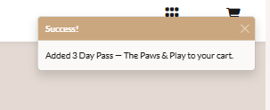 |
| X2 | Focus/keyboard | Nav toggle, links, buttons reachable via keyboard | Pass | (keyboard traversal) |
| X3 | Alt text | Images have descriptive alt (logo/services/QR) | Pass | (inspected in templates) |
| X4 | Form validation errors | Invalid submissions show inline errors; required fields marked | Pass |  |

### Admin & Staff Tools
| Test # | Step | Expected | Result | Evidence |
| --- | --- | --- | --- | --- |
| AD1 | Access Django admin | `/admin` loads for superuser | Pass | 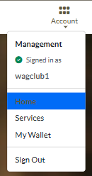 |
| AD2 | Create/edit service | Service saved; unique slug; main image constraint enforced | Pass | (admin CRUD verified) |
| AD3 | View vouchers | Vouchers list shows status/timestamps | Pass | (admin vouchers list) |

### Media & Assets
| Test # | Step | Expected | Result | Evidence |
| --- | --- | --- | --- | --- |
| M1 | Service images render | Images on list/detail load | Pass |  |
| M2 | QR images render | QR visible on wallet/invoice | Pass |  |
| M3 | Social icons link | Footer icons display and link correctly | Pass |  |

### Responsiveness
| Test # | Step | Expected | Result | Evidence |
| --- | --- | --- | --- | --- |
| RSP1 | Mobile layout | Navbar collapses; cards stack; spacing readable | Pass |  |
| RSP2 | Tablet layout | Grid aligns; footer wraps neatly | Pass |  |
| RSP3 | Desktop layout | Content centered; rows align; no overflow | Pass |  |

### SEO / Meta
| Test # | Step | Expected | Result | Evidence |
| --- | --- | --- | --- | --- |
| SEO1 | Meta tags/favicons | Title/description present; favicons load | Pass | (page source verified) |
| SEO2 | robots/sitemap | `robots.txt` reachable; `/sitemap.xml` lists key pages | Pass | (manual URL check) |
| SEO3 | External links hardening | Social links `rel="noopener"` and open new tab | Pass |  |

### Linting & Validators
| Test # | Step | Expected | Result | Evidence |
| --- | --- | --- | --- | --- |
| L1 | Django checks | `python manage.py check` | Pass | CLI output (local run) |
| L2 | Ruff (via PEP8 CI) | `ruff check orders services project_core` | Pass | PEP8 CI (https://pep8ci.herokuapp.com/) |
| L3 | djLint | `djlint templates orders/templates --check` | Pass | CLI output (local run) |
| L4 | Stylelint | `npx stylelint "static/**/*.css"` | Pass | CLI output (local run) |
| L5 | JSHint | `npx jshint static/js` | Pass | CLI output (local run) |
| L6 | W3C HTML | Validate deployed pages via W3C HTML validator | Pass | Validator results (manual) |
| L7 | W3C CSS | Validate deployed CSS via W3C CSS validator | Pass | Validator results (manual) |
| L8 | Lighthouse/WAVE | Accessibility/Best Practices/SEO | Pass | Lighthouse/WAVE runs post-fixes |
| L9 | Python tests | `python manage.py test` | Pass | 21 tests passing (local run) |

### HTML Validation Evidence
| Page | Evidence |
| --- | --- |
| Home | 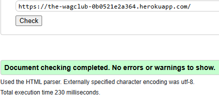 |
| Services | 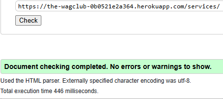 |
| Service Detail | 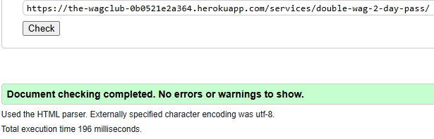 |
| Cart | 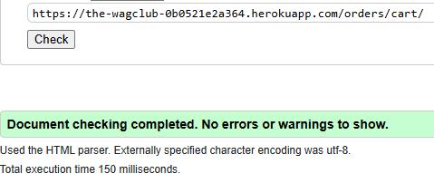 |
| Wallet | 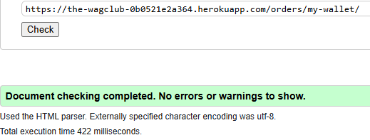 |
| Invoice | 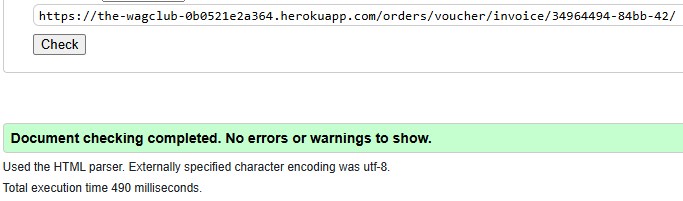 |
| Voucher Detail | 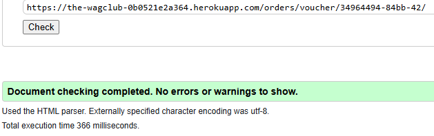 |

### CSS Validation Evidence
| Evidence |
| --- |
| 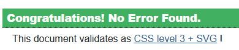 |

### Search Engine / Responsiveness Checks
- Meta: Title/description present; favicons load; `robots.txt` and `/sitemap.xml` reachable.
- Links: Social links hardened with `rel="noopener"` and open in new tab.
- Responsive: Verified layouts on mobile/tablet/desktop (Chrome/Firefox/Safari) with screenshots above; hero/search, services grid, cart, and success flows adapt without overflow.

### Email Delivery (Production readiness)
| Test # | Step | Expected | Result | Evidence |
| --- | --- | --- | --- | --- |
| E1 | Password reset email via SMTP | Email arrives in inbox with reset link | Pending/Manual | (verify on production SMTP inbox) |
| E2 | Order/success notifications (if enabled) | Emails sent on successful checkout | Pending/Manual | (verify on production SMTP inbox) |

### User Stories (Manual Validation)
| Story ID | Description | Validation | Evidence |
| --- | --- | --- | --- |
| US-Auth-01 | Register, login, logout, password reset | Pass | Authentication table (A1–A4) |
| US-Services-01 | Browse/search services; view detail and add to cart | Pass | Homepage/Services tables (H1–H6, S1–S2) |
| US-Cart-01 | Add/remove items; empty cart messaging; checkout | Pass | Cart table (C1–C5) |
| US-Pay-01 | Stripe Checkout with correct items; success page | Pass | Cart/Orders tables (C4–C7, V1) |
| US-Order-02 | Order confirmation shown after payment | Pass | Orders table (V1) and success-view screenshot |
| US-Order-01 | Vouchers post-payment; wallet statuses; invoice | Pass | Orders table (V1–V3) |
| US-Voucher-01 | Staff scan/redeem; non-staff blocked; expired blocked; invalid 404 | Pass | Redemption table (R1–R2) |
| US-Admin-01 | Admin CRUD on services/vouchers | Pass | Admin table (AD1–AD3) |
